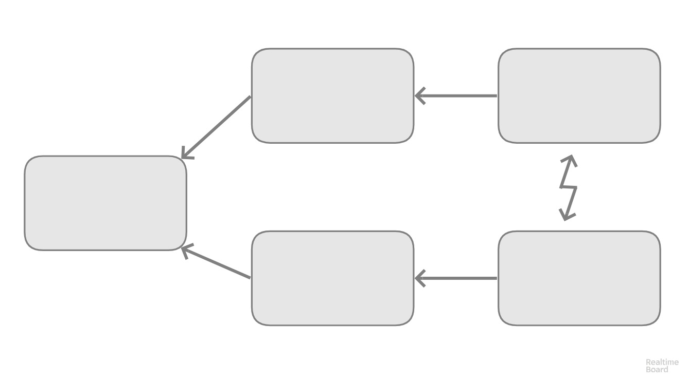
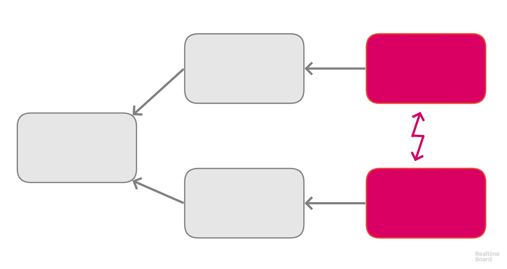
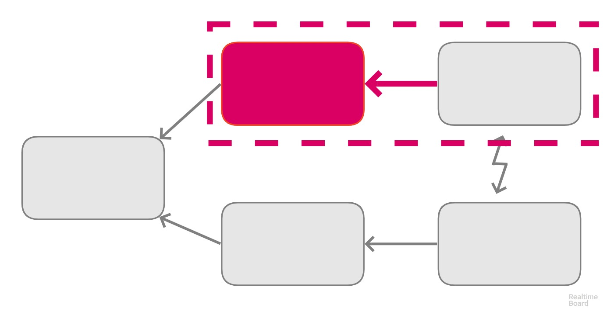
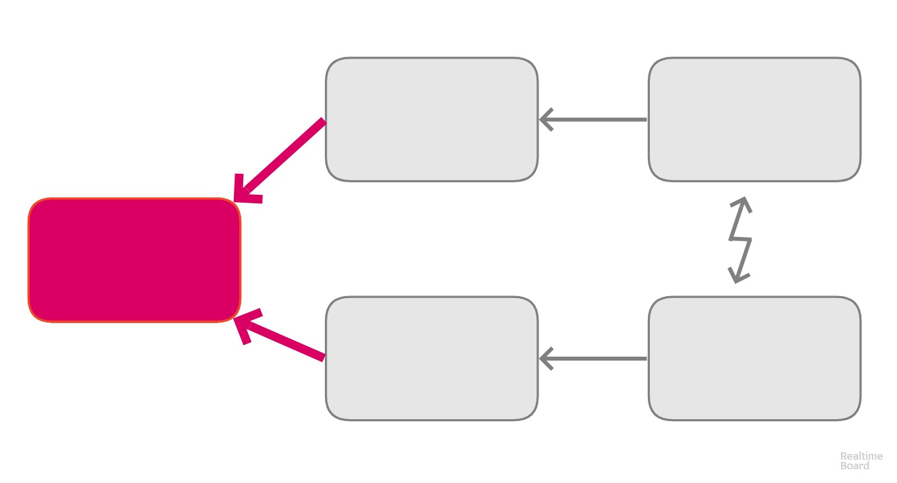
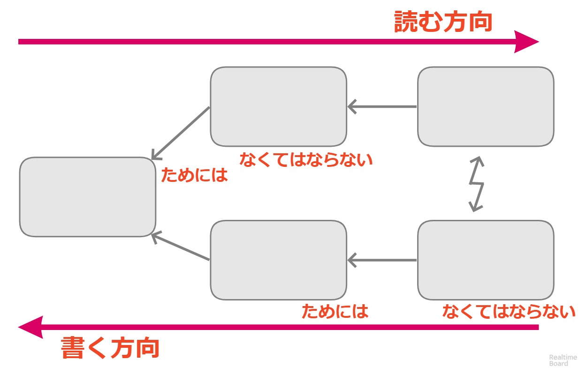
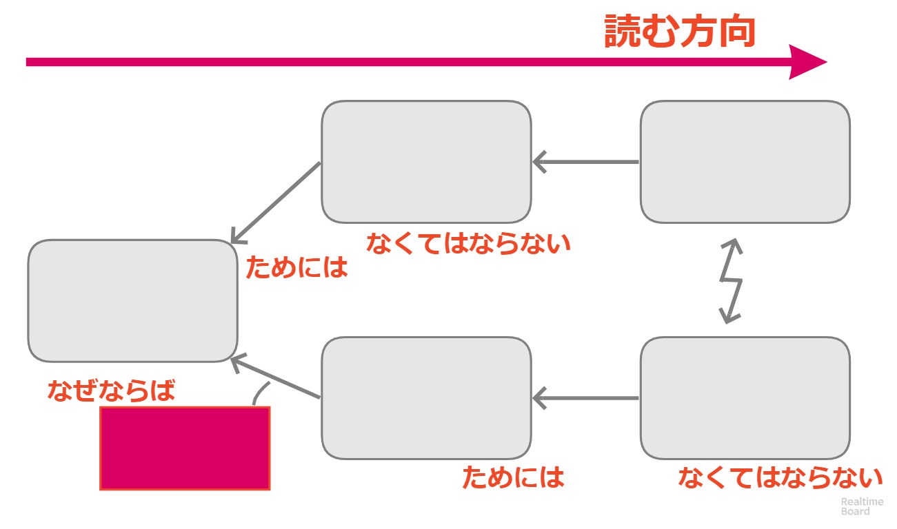

<!-- .slide: data-background-image="img/front_page.jpg" -->

# クラウド

TOCfE BootCamp KANSAI 2018/07/21

- 講師デモ <!-- .element: style="font-size: 70%;" -->
- 全体演習 <!-- .element: style="font-size: 70%;" -->
- ガイド付きグループ演習 <!-- .element: style="font-size: 70%;" -->
- グループ演習 <!-- .element: style="font-weight: 900;" -->
- 個人演習 <!-- .element: style="font-size: 70%;" -->

--

 <!-- .element height="10%" width="10%" align="left" -->

  1. WEB系アプリのエンジニア
  2. TOCfEに触れたのは 2017年04月 が初めて
  3. 国際認定プログラムを経て講師は2回目

---

2つの文章を読んでクラウドを作成してください

--

<!-- .slide: style="text-align: left; font-size: 60%;" -->

## 1. MARS Generation

Netflixオリジナル ドキュメンタリーより <!-- .element: style="font-size: 80%;" -->

旧ソ連への恐怖が後押しした1969年の月面着陸以降、2011年までの30年間地球低軌道を周回する貨物輸送にすぎないスペースシャトルが宇宙開発の資金を食いつぶした。第2次世界大戦後にドイツよりアメリカへ移住したロケット開発指導者W.フォン・ブラウンが目指した火星へゆくという計画が停滞してからは、有人による宇宙探査ではなくロボットを火星へ送り込み探査が行われている。しかしロボット探査は有人探査に劣る性能しか出せない現実があり、問題は解決できていない。

スペースキャンプではNASAの施設や宇宙飛行士の訓練を元にしたシュミレーションが行い、参加している子どもたちは将来本気で火星に行くつもりで工学課題に取り組み、宇宙探査に向けた訓練に参加している。  
「いずれ公職について有人火星探査に予算を割り当てる仕事をしたい」  
「学校ではオタクだと馬鹿にされるけど、キャンプでは好きなことができるから楽しいわ」  
「火星に行って死んだら悲しいけど、少なくとも夢が叶えられるから嬉しいと思う」

それぞれに希望を持つ子どもたちに課題の次のステップを用意するため、大人は資金の調達および運用が終了したスペースシャトルに代わる打ち上げ機の開発に取り組まなければならない。

--

<!-- .slide: style="text-align: left; font-size: 60%;" -->

## 2. マーキュリー13

Netflixオリジナル ドキュメンタリーより <!-- .element: style="font-size: 80%;" -->

1960年代以前から米国社会における女性とは政治的・経済的・文化的にあらゆる権利がなく、また肉体的にも男性に劣っていると見なされていた。  
宇宙飛行士となる試験の結果も男性宇宙飛行士と同等と評価されながら、当時空軍従事者が対象とされた宇宙飛行士になる基準の1つである「戦闘機への搭乗資格」が法律で規定されておらず、搭乗できない女性たちは裁判で自らの能力を証明しようと闘ったが宇宙飛行士になる資格を得ることはなかった。

サリー・ライドは米国女性としてはじめて宇宙に進出した。1983年のことである。
1963年に世界初の女性宇宙飛行士となった旧ソ連のワレンチナ・テレシコワに続く3人目の宇宙飛行士であり、彼女は記者会見場に宇宙飛行士資格を得るために闘ったかつての候補生たちを招き、「彼女たちがいなければ私はここにいなかった」と彼女たちを讃えた。

現在スペースシャトルへの搭乗は軍属、性別、国籍に限らず門戸が開かれている。

---

### クラウドのおさらい

クラウドは5つのボックスと  
ボックスのつながりを示す矢印で構成される

 <!-- .element height="80%" width="80%" style="border: none;" -->

--

### 対立している状況

衝突する2者間(立場や手段)を  
2つのボックスにそれぞれを書き出す

 <!-- .element height="80%" width="80%" style="border: none;" -->

--

### なぜ？

なぜ対立する状況になるのか、  
要望を対立するボックスにつなげる

 <!-- .element height="80%" width="80%" style="border: none;" -->

--

### どうなれば良いか

2つの要望を同時に満たせる目標は何だろうか？

 <!-- .element height="80%" width="80%" style="border: none;" -->

--

### クラウドを確認する

間違いなく意味が通っていることを確認するには、
声に出して読み上げることで確認できる

 <!-- .element height="70%" width="70%" style="border: none;" -->

--

### つながりを説明する

なぜボックスがつながるのか情報不足があれば、
仮定のボックスをつなげて説明する

 <!-- .element height="80%" width="80%" style="border: none;" -->

--

### 解決策を出す

妥協や一方を貶めるのではなく  
両者を満たす解決策とは何かを考える

 <!-- .element height="80%" width="80%" style="border: none;" -->

---

## 特定するための質問

読み上げることの他に、  
ボックスそれぞれに異なる表現で質問することで根底の原因が見つけやすくなる

--

<!-- .slide: style="font-size: 90%;" -->

- 対立
  + それぞれの立場は何をしたいのですか？  <!-- .element: class="fragment" -->
  + ある立場で取りたい行動と別の立場と対立するものはなんですか？  <!-- .element: class="fragment" -->
- 要望
  + それぞれの立場はどういう行動を選択しましたか？  <!-- .element: class="fragment" -->
  + なぜこの行動や手段が重要なのですか？  <!-- .element: class="fragment" -->
  + この行動を取らないとどのような要望が脅かされますか？  <!-- .element: class="fragment" -->
- 目標
  + 2者が達成したいと思うような、似通った目標はありますか？  <!-- .element: class="fragment" -->
  + 2者が望むような理想的な状況になりますか？  <!-- .element: class="fragment" -->

--

違和感がなくなるまで
書いて読み直しましょう

---

グループ演習開始